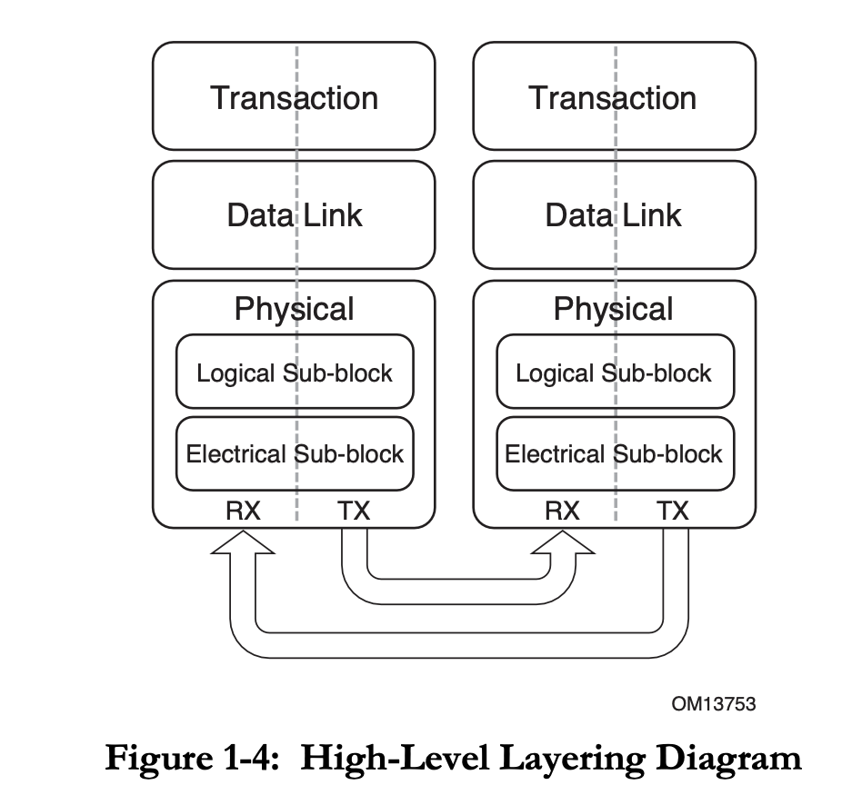
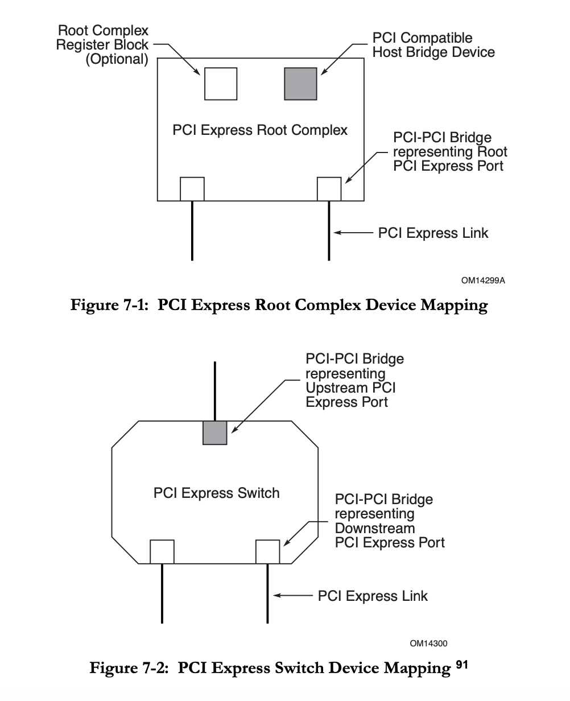
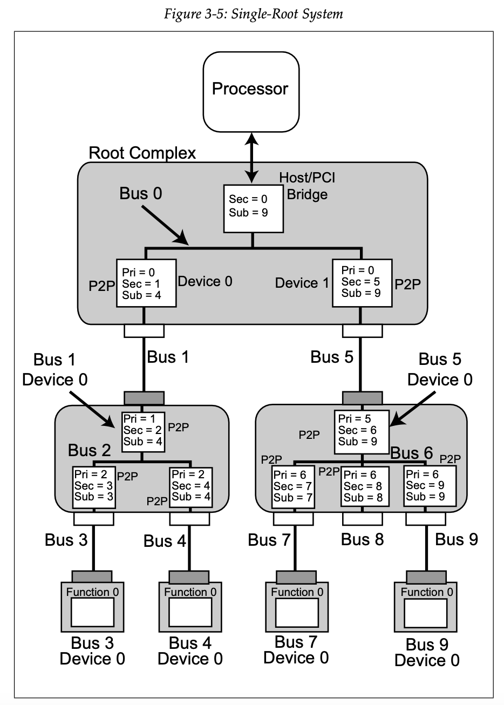
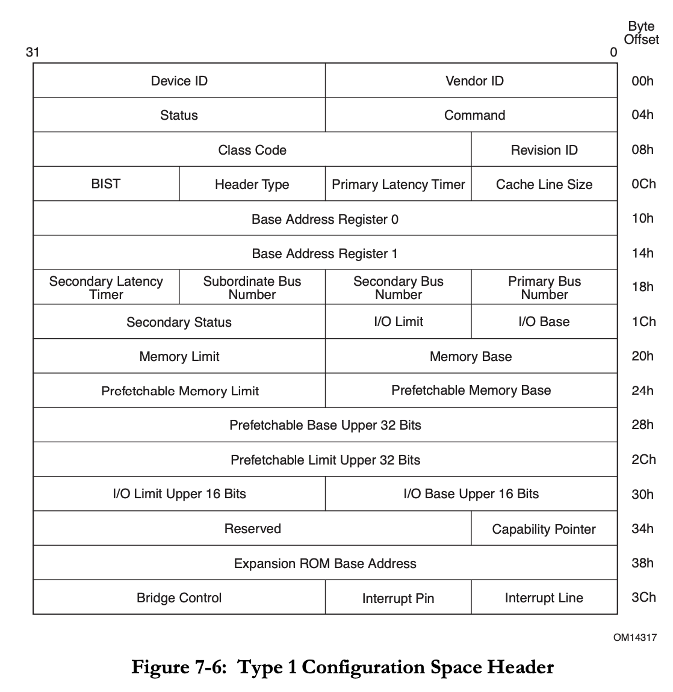
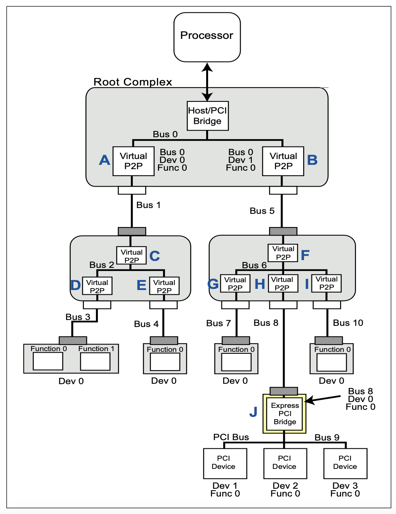

# PCIe

## 分层

PCIe 定义了三个层：Transaction Layer，Data Link Layer，Physical Layer，和 TCP/IP 四层模型很像。PCIe 也是基于 Packet 传输的。

<figure markdown>
  { width="600" }
  <figcaption>PCIe 分层（图源 PCIe 3.0 标准）</figcaption>
</figure>

### Transaction Layer

Transaction Layer 的核心是 Transaction Layer Packet(TLP)。TLP 格式：

<figure markdown>
  { width="600" }
  <figcaption>PCIe TLP 格式（图源 PCIe 3.0 标准）</figcaption>
</figure>

即可选的若干个 Prefix，一个 Header，可选的 Data Payload，可选的 Digest。

Prefix 和 Header 开头的一个字节是 `Fmt[2:0]` 和 `Type[4:0]` 字段。Fmt 决定了 header 的长度，有无数据，或者这是一个 Prefix。

它支持几类 Packet：

- Memory: MMIO
    - Read Request(MRd)/Completion(CplD)
    - Write Request(MWr): 注意只有 Request，没有 Completion
    - AtomicOp Request(FetchAdd/Swap/CAS)/Completion(CplD)
    - Locked Memory Read(MRdLk)/Completion(CplDLk): Legacy
- IO: Legacy
    - Read Request(IORd)/Completion(CplD)
    - Write Request(IOWr)/Completion(Cpl)
- Configuration: 访问配置空间
    - Read Request(CfgRd0/CfgRd1)/Completion(CplD)
    - Write Request(CfgWr0/CfgWr1)/Completion(Cpl)
- Message: 传输 event
    - Request(Msg/MsgD)

括号里的是 TLP Type，对应了它 Fmt 和 Type 字段的取值。如果 Completion 失败了，原来应该是 CplD/CplDLk 的 Completion 会变成不带数据的 Cpl/CplLk。


在 PCIe 3.0 标准的表 2-3 中列出了 TLP Type 以及对应的 Fmt 和 Type 编码。

TLP 路由有三个方法，决定了这个 TLP 目的地是哪里：

- Address-based: 32 位或 64 位地址，用于 Memory 和 IO 请求
- ID-based：lspci 看到的地址，也就是 Bus Device Function，用于 Configuration 请求
- Implicit：用于 Message 请求，路由方法：
    - Routed to Root Complex
    - Routed by Address: PCIe 3.0 标准中没有用这个路由方法的 Message
    - Routed by ID
    - Broadcast from Root Complex
    - Local - Terminate at Receiver
    - Gathered and router to Root Complex


### Data Link Layer

Data Link Layer 的主要功能是进行 TLP 的可靠传输。它在传输 TLP 的时候，会在开头加上一个两字节的 Sequence Number，最后加上一个四字节的 LCRC（Link CRC）。

<figure markdown>
  { width="600" }
  <figcaption>PCIe TLP Data Link Layer 格式（图源 PCIe 3.0 标准）</figcaption>
</figure>

除了传输 TLP，Data Link Layer 还会传输 Data Link Layer Packet(DLLP)，类型包括：

- Ack DLLP: 告诉对方自己已经成功收到了 TLP
- Nak DLLP：告诉对方自己接收 TLP 失败，请重试
- InitFC1/InitFC2/UpdateFC DLLPs：流量控制
- PM_Enter_L1/PM_Enter_L23/PM_Active_State_Request_L1/PM_Request_Ack：用于电源管理

Data Link Layer 收到上层要发送 TLP 时候，首先拼接 Sequence Number 和 LCRC，然后会保存在 retry buffer 中，通过 Physical Layer 发送。从 Physical Layer 收到新的 TLP/DLLP 时，会检查它的完整性（CRC），如果正确，就向发送方发送一个 Ack DLLP，并把 TLP 提交给 Transaction Layer；如果不正确，就向发送方发送一个 Nak DLLP。如果收到了 Ack DLLP，就可以把相应的 TLP 从 retry buffer 中删掉；如果收到了 Nak DLLP，则要重传。这样就实现了 TLP 的可靠传输。

需要注意的是，TLP 和 DLLP 的区别：TLP 就像 IP，目的地址可能会跨越多跳；而 DLLP 是点对点地工作，所以一个 TLP 在转发的每一跳中，接受方都会发送一次 Ack DLLP。

Data Link Layer 的流量是 Credit-based 的：接受方会告诉发送方自己的 Buffer 还有多少空间（Credit），然后发送方根据 Credit 来控制是否继续发送 TLP。

## 配置

接触 PCIe 的时候可能会有一个疑惑，就是这些 Bus Device Function 都是怎么分配的，分配完之后，访问请求又是怎么路由的。

### 路由

首先回顾一下，上面提到了 TLP 的 Memory 和 IO 是根据地址路由，Configuration 是根据 Bus Device Function 路由，而 PCIe 大概是一个树形的结构，叶子结点就是 PCIe 设备，非叶子结点是桥或者交换机。回想一下，IP 的路由是按照最长前缀匹配，如果在 PCIe 中还这样做的话，又太过于复杂了，毕竟 PCIe 可以人为地设定每个设备的地址，让地址满足一定的连续性和局部性，这样路由选择就非常简单了。

观察 PCIe 标准中 7.3.3 Configuration Request Routing Rules，结合 MindShare 的书，看 Root Ports，Switches 和 Bridges 的要求，就知道 Configuration 请求是如何路由的：

- Configuration 请求只能由 Host Bridge 发起
- 如果 Configuration 请求是 Type0，那么这个请求的目的设备就是当前设备
- 如果 Configuration 请求是 Type1，
    - 如果请求的 Bus Number 等于某一个 Downstream Port 的 Secondary Bus Number，则把 Configuration 请求转换为 Type0，然后发给该 Downstream Port
    - 如果不等于，但是 Bus Number 属于某一个 Downstream Port 的 Secondary Bus Number 和 Subordinate Bus Number 之间，则不修改 Configuration 请求，发送给该 Downstream Port。

如果类比一下 IP，那么分组在中途路由器转发的时候就是 Type1，Type0 就是最后一跳。路由就是直接按照几个不重合的 Bus Number 区间进行判断，没有复杂的最长前缀匹配。但是又有一个问题，如果按照 Bus 路由，那同一个 Bus 下不同的 Device 咋办？这就像是以太网，最后一跳的时候，如果同一个链路上有多个设备，那么多个设备都能收到，每个设备根据自己的 Device 号判断是否是发给自己的。PCI（注意不是 PCIe）总线也类似。随着速度越来越高，通过交换机，以太网已经变成了点对点，所以很少见到一个链路上同时有多个设备的情况了。PCIe 也一样，所以根据 Bus 路由就足够了。至于 lspci 看到的那些 Device 不等于 0 的设备，要么是兼容 PCI 设备的，要么是虚拟的，在设备内部进行路由的，并不是真的有一个 PCIe link 连了多个物理设备。

所以简单理解一下，PCI 总线确实是一条总线，一条总线上很多设备。而 PCIe 实际上是一个网络，可以看作是很多个 PCI 总线连接在一起，可以把 Root Complex 或者 Switch 内部看成一个虚拟的有很多设备的 PCI 总线，而 PCIe Link 可以看成是只有一个设备的 PCI 总线。这样 PCIe 交换机可以看成若干个 PCI-PCI Bridge：

<figure markdown>
  { width="600" }
  <figcaption>PCIe 交换机和 Root Complex 内部图解（图源 PCIe 3.0 标准）</figcaption>
</figure>

还有 MindShare 书中的图 3-5:

<figure markdown>
  { width="600" }
  <figcaption>PCIe 完整拓扑（图源 MineShare PCIe 3.0 书）</figcaption>
</figure>

可以看到，这里的每一个 Bus 就是一个 PCI 总线，既有内部的虚拟 PCI 总线（Bus 0/2/6），也有 PCIe Link 充当的 PCI 总线（Bus 1/3/4/5/7/8/9）。在虚拟的 PCI 总线里，比如 PCIe Switch，一个 Device 对应一个 Downstream Port；而 PCIe Link 对应的 PCI 总线上就只有一个 Device。然后 PCIe Switch 的每个 Upstream Port 和 Downstream Port 里会记录三个 Bus Number：Primary(Pri)，Secondary(Sec) 和 Subordinate(Sub)。Primary 指的就是它上游直接连接的 PCI 总线编号，Sec 指的是下游直接连接的 PCI 总线编号，Sub 指的是它下游的最大 PCI 总线编号。

这样，收到 Type1 的时候，Switch 按照各个 Downstream Port 的 Sec 和 Sub 进行判断，如果目标 Bus Number 等于 Sec，就转换为 Type0 发出去；如果大于 Sec，但是小于或等于 Sub，就原样发出去。可以看到，从 Host Bridge 到每个设备都可以通过这样的方式一路转发。

既然 BDF 是把 Bus 划分为多个区间来路由的，那么 Memory 和 IO 请求也类似地可以对地址进行划分，变成多个区间，然后用类似的方法进行路由。

这些用于路由的区间上下界，可以在各个端口的 Type1 Configuration Space 中找到：

<figure markdown>
  { width="600" }
  <figcaption>PCIe Type1 Configuration Space（图源 PCIe 3.0 标准）</figcaption>
</figure>

- 路由 Type1 Configuration Request：Primary Bus Number, Secondary Bus Number, Subordinate Bus Number
    - `Request Bus Number == Secondary Bus Number`: Type1 -> Type0
    - `Secondary Bus Number < Request Bus Number <= Subordinate Bus Number`: Type1 -> Type1
- 路由 IO Request：`I/O Base <= IO Address <= I/O Limit`
- 路由 Prefetchable Memory Request：`Prefetchable Memory Base <= Memory Address <= Prefetchable Memory Limit`
- 路由 Non-Prefetchable Memory Request：`Memory Base <= Memory Address <= Memory Limit`

而具体到每一个设备上，设备会提供若干个 BAR（Base Address Register），在枚举设备的时候，会给 BAR 分配地址，然后把设备的地址进行合并，记录到 Switch 上的 Base 和 Limit，然后一直递归，一路更新到 Root Complex。这样，就完成了地址分配，以及请求的路由。

### 分配

既然知道了 BDF 是如何路由的，那么接下来的问题是，怎么枚举设备和交换机，分配 Bus Number。这个事情在系统启动的时候会做（例如 UEFI），Linux 中也有相关的代码。下面就来对着 [edk2](https://github.com/tianocore/edk2) 的源代码来看看它是怎么做的。

在 edk2 中，分配 Bus Number 的核心代码是 `PciScanBus` 函数：

```cpp
/**
  Scan pci bus and assign bus number to the given PCI bus system.

  @param  Bridge           Bridge device instance.
  @param  StartBusNumber   start point.
  @param  SubBusNumber     Point to sub bus number.
  @param  PaddedBusRange   Customized bus number.

  @retval EFI_SUCCESS      Successfully scanned and assigned bus number.
  @retval other            Some error occurred when scanning pci bus.

  @note   Feature flag PcdPciBusHotplugDeviceSupport determine whether need support hotplug.

**/
EFI_STATUS
PciScanBus (
  IN PCI_IO_DEVICE  *Bridge,
  IN UINT8          StartBusNumber,
  OUT UINT8         *SubBusNumber,
  OUT UINT8         *PaddedBusRange
  );
```

输入一个桥设备和初始的 Bus Number，输出 Subordinate Bus Number，也就是分配的最大的 Bus Number，以及 Padded Bus Range，例如如果要考虑热插拔的话，就需要预留一些 Bus Number。它在 `PciRootBridgeEnumerator` 函数中被调用，传入的是 RootBridgeDev。你可能也猜到了，这个函数可以递归调用，从 Root Bridge 开始往下，遇到新的桥设备的时候，就继续递归，然后根据下一层分配的 Bus Number 来计算上一层的 Subordinate Bus Number。

`PciScanBus` 首先枚举当前桥设备下的所有 Device 和 Function，因为当前的桥设备已经被分配了 Bus Number，所以是可以访问它下面的 Device 和 Function 的。

```cpp
for (Device = 0; Device <= PCI_MAX_DEVICE; Device++) {
  TempReservedBusNum = 0;
  for (Func = 0; Func <= PCI_MAX_FUNC; Func++) {
    //
    // Check to see whether a pci device is present
    //
    Status =
        PciDevicePresent(PciRootBridgeIo, &Pci, StartBusNumber, Device, Func);

    if (EFI_ERROR(Status) && (Func == 0)) {
      //
      // go to next device if there is no Function 0
      //
      break;
    }

    if (EFI_ERROR(Status)) {
      continue;
    }

    //
    // Get the PCI device information
    //
    Status =
        PciSearchDevice(Bridge, &Pci, StartBusNumber, Device, Func, &PciDevice);

    if (EFI_ERROR(Status)) {
      continue;
    }

    PciAddress = EFI_PCI_ADDRESS(StartBusNumber, Device, Func, 0);

    if (IS_PCI_BRIDGE(&Pci) || IS_CARDBUS_BRIDGE(&Pci)) {
      //
      // For PPB
      //

      Status = PciAllocateBusNumber(Bridge, *SubBusNumber, 1, SubBusNumber);
      if (EFI_ERROR(Status)) {
        return Status;
      }

      SecondBus = *SubBusNumber;

      Register = (UINT16)((SecondBus << 8) | (UINT16)StartBusNumber);
      Address = EFI_PCI_ADDRESS(StartBusNumber, Device, Func,
                                PCI_BRIDGE_PRIMARY_BUS_REGISTER_OFFSET);

      Status = PciRootBridgeIo->Pci.Write(PciRootBridgeIo, EfiPciWidthUint16,
                                          Address, 1, &Register);

      //
      // If it is PPB, recursively search down this bridge
      //
      if (IS_PCI_BRIDGE(&Pci)) {
        //
        // Temporarily initialize SubBusNumber to maximum bus number to ensure
        // the PCI configuration transaction to go through any PPB
        //
        Register = PciGetMaxBusNumber(Bridge);
        Address = EFI_PCI_ADDRESS(StartBusNumber, Device, Func,
                                  PCI_BRIDGE_SUBORDINATE_BUS_REGISTER_OFFSET);
        Status = PciRootBridgeIo->Pci.Write(PciRootBridgeIo, EfiPciWidthUint8,
                                            Address, 1, &Register);

        Status = PciScanBus(PciDevice, SecondBus, SubBusNumber, PaddedBusRange);
        if (EFI_ERROR(Status)) {
          return Status;
        }
      }

      //
      // Set the current maximum bus number under the PPB
      //
      Address = EFI_PCI_ADDRESS(StartBusNumber, Device, Func,
                                PCI_BRIDGE_SUBORDINATE_BUS_REGISTER_OFFSET);

      Status = PciRootBridgeIo->Pci.Write(PciRootBridgeIo, EfiPciWidthUint8,
                                          Address, 1, SubBusNumber);
    } else {
      //
      // It is device. Check PCI IOV for Bus reservation
      // Go through each function, just reserve the MAX ReservedBusNum for one
      // device
      //

      // OMITTED
    }

    if ((Func == 0) && !IS_PCI_MULTI_FUNC(&Pci)) {
      //
      // Skip sub functions, this is not a multi function device
      //

      Func = PCI_MAX_FUNC;
    }
  }
}
```

从代码中去掉了一些热插拔相关的代码，简单来说，它的思路如下：

1. 枚举当前设备下的 Device 和 Function
2. 如果找到了一个桥设备，为它分配一个新的 Bus Number
    1. 设置这个新的桥设备的 Primary Bus Number 为 Start Bus Number（也就是上一级的 Secondary Bus Number），Secondary Bus 是新分配的 Bus Number，Subordinate Bus Number 是最大值
    2. 这样设置完成后，相当于所有的在 `[Secondary Bus Number, Max Bus Number]` 范围中的 Bus 请求都会路由到新的桥设备上
    3. 递归调用 PciScanBus，参数是新的桥设备，Start Bus Number 为新的 Secondary Bus Number
    4. 递归调用返回以后，新的桥设备下面所有的设备都分配到了自己的 Bus Number，这时候就可以知道准确的 Subordinate Bus Number 了，不再是刚才临时设置的 Max Bus Number，因此这时候再把准确的 Subordinate Bus Number 写入桥设备的 Subordinate Bus Number 中
3. 枚举完所有设备以后，返回目前递归分配得到的最大的 Bus Number

这样整理出来一看，其实很清楚，这就是一个 DFS 算法，在搜索过程中，为了保证当前的结点可达，保证从 Root Bridge 到当前的结点路径上的 Bus Number 范围都是 `[Secondary Bus Number, Max Bus Number]`；当结点搜索完以后，再回溯，回溯的时候就知道了实际分配到多大的 Bus Number，这时候再填回 Subordinate Bus Number，最后保证这个树上每一层的 `[Secondary Bus Number, Subordinate Bus Number]` 区间不重合，且每个子结点的区间都包含于父结点的区间。

最后的结果，类似 MindShare 书中的这个图：

<figure markdown>
  { width="600" }
  <figcaption>PCIe 枚举结果（图源 MineShare PCIe 3.0 书）</figcaption>
</figure>

为了支持 PCIe 热插拔，或者可能会动态产生新设备的 SR-IOV，代码中做了相应的预留：

```cpp
if (FeaturePcdGet(PcdPciBusHotplugDeviceSupport)) {
  //
  // If Hot Plug is supported,
  // Get the bridge information
  //
  BusPadding = FALSE;
  if (gPciHotPlugInit != NULL) {
    if (IsPciHotPlugBus(PciDevice)) {
      //
      // If it is initialized, get the padded bus range
      //
      Status = gPciHotPlugInit->GetResourcePadding(
          gPciHotPlugInit, PciDevice->DevicePath, PciAddress, &State,
          (VOID **)&Descriptors, &Attributes);

      if (EFI_ERROR(Status)) {
        return Status;
      }

      BusRange = 0;
      NextDescriptors = Descriptors;
      Status = PciGetBusRange(&NextDescriptors, NULL, NULL, &BusRange);

      FreePool(Descriptors);

      if (!EFI_ERROR(Status)) {
        BusPadding = TRUE;
      } else if (Status != EFI_NOT_FOUND) {
        //
        // EFI_NOT_FOUND is not a real error. It indicates no bus number padding
        // requested.
        //
        return Status;
      }
    }
  }
}

if (FeaturePcdGet(PcdPciBusHotplugDeviceSupport) && BusPadding) {
  //
  // Ensure the device is enabled and initialized
  //
  if ((Attributes == EfiPaddingPciRootBridge) &&
      ((State & EFI_HPC_STATE_ENABLED) != 0) &&
      ((State & EFI_HPC_STATE_INITIALIZED) != 0)) {
    *PaddedBusRange = (UINT8)((UINT8)(BusRange) + *PaddedBusRange);
  } else {
    //
    // Reserve the larger one between the actual occupied bus number and padded
    // bus number
    //
    Status = PciAllocateBusNumber(PciDevice, SecondBus, (UINT8)(BusRange),
                                  &PaddedSubBus);
    if (EFI_ERROR(Status)) {
      return Status;
    }

    *SubBusNumber = MAX(PaddedSubBus, *SubBusNumber);
  }
}
```

SR-IOV:

```cpp
//
// It is device. Check PCI IOV for Bus reservation
// Go through each function, just reserve the MAX ReservedBusNum for one device
//
if (PcdGetBool(PcdSrIovSupport) && (PciDevice->SrIovCapabilityOffset != 0)) {
  if (TempReservedBusNum < PciDevice->ReservedBusNum) {
    Status = PciAllocateBusNumber(
        PciDevice, *SubBusNumber,
        (UINT8)(PciDevice->ReservedBusNum - TempReservedBusNum), SubBusNumber);
    if (EFI_ERROR(Status)) {
      return Status;
    }

    TempReservedBusNum = PciDevice->ReservedBusNum;

    if (Func == 0) {
      DEBUG((DEBUG_INFO, "PCI-IOV ScanBus - SubBusNumber - 0x%x\n",
             *SubBusNumber));
    } else {
      DEBUG((DEBUG_INFO, "PCI-IOV ScanBus - SubBusNumber - 0x%x (Update)\n",
             *SubBusNumber));
    }
  }
}
```

分配好 Bus 以后，就可以对所有设备进行 Configuration Request 了，后续的 Memory 和 IO 地址的分配和路由，也是类似地递归地进行分配，然后回溯的时候合并地址区间即可。

## 物理层

物理层编码上，PCIe 1.0 和 2.0 采用的是 NRZ 8b/10b，PCIe 3.0 到 5.0 用的是 NRZ 128b/130b，最新的 PCIe 6.0 和 7.0 则换成了 PAM4 FLIT。可以计算出每一代 x16 Lane 情况下的最大数据带宽：

- PCIe 1.0: `2.5 * 8 / 10 * 16 = 32 Gb/s`
- PCIe 2.0: `5.0 * 8 / 10 * 16 = 64 Gb/s`
- PCIe 3.0: `8.0 * 128 / 130 * 16 = 126 Gb/s`
- PCIe 4.0: `16.0 * 128 / 130 * 16 = 252 Gb/s`
- PCIe 5.0: `32.0 * 128 / 130 * 16 = 504 Gb/s`
- PCIe 6.0: `64.0 * 16 = 1024 Gb/s`，如果考虑 FLIT 引入的开销，则是 `64.0 * 242 / 256 * 16 = 968 Gb/s`
- PCIe 7.0: `128.0 * 16 = 2048 Gb/s`，如果考虑 FLIT 引入的开销，则是 `128.0 * 242 / 256 * 16 = 1936 Gb/s`

## PCIe 6.0

PCIe 6.0 引入了 PAM4 来替代原来的 NRZ，实现了波特率不变的情况下速度翻倍，并且不再使用 128b/130b，为了解决 PAM4 带来的更高的错误率，引入了 FEC，CRC 还有格雷码，以及新的 FLIT。

网上可以搜到关于 PCIe 的 PPT：https://pcisig.com/sites/default/files/files/PCIe%206.0%20Webinar_Final_.pdf 和 https://www.openfabrics.org/wp-content/uploads/2022-workshop/2022-workshop-presentations/206_DDasSharma.pdf，以及关于 FLIT 的博客：https://pcisig.com/blog/pcie%C2%AE-60-specification-webinar-qa-deeper-dive-flit-mode-pam4-and-forward-error-correction-fec

总结 FLIT 的要点：

1. 每个 FLIT 固定长度 256 字节，其中 236 字节传输 TLP，6 字节传输 DLLP，8 字节传输 CRC，6 字节传输 FEC。
2. 接受方接受到 FLIT 后，会尝试进行 FEC 解码，并且尝试修复错误，再进行 CRC 校验。如果中途出现了错误，则会发送一个 NAK 给发送方。
2. 一个 TLP 可能跨越多个 FLIT，一个 FLIT 可能包括多个 TLP，根据 TLP 大小而定。TLP 不需要对齐到 FLIT 的开头或者结尾。

可以发现，FLIT 的 CRC 用了 8 个字节，不再需要原来 TLP 和 DLLP 中的 ECRC 和 LCRC。在之前的 PCIe 版本，TLP 的可选 Digest 是 4 个字节的 ECRC，TLP+DLLP 的 LCRC 是 4 字节。具体采用多少字节的 CRC，和目标的错误率，以及传输的字节数相关。

## ATS

ATS（Address Translation Service）是在 PCIe 上给外设提供查询页表的方式，从而可以使用虚拟地址。标准可以在 https://composter.com.ua/documents/ats_r1.1_26Jan09.pdf 处下载，以及关于 ATS 的 PPT：https://composter.com.ua/documents/Address_Translation_Services.pdf。

它的整体工作方式如图：

<figure markdown>
  { width="600" }
  <figcaption>PCIe ATS 工作方式（图源 PCIe ATS 标准）</figcaption>
</figure>

就是在 Root Complex 和 Memory 之间设置一个 Translation Agent，负责查表，也就是 Page Table Walker。它会接收来自 PCIe 设备的地址翻译请求，然后它获取到页表地址后，根据虚拟地址去查内存中的页表。TLB（在标准中叫做 Address Translation Cache，ATC）是实现在 PCIe 设备侧的，而不是统一的 TLB，也不是 CPU 核心的 TLB。

为了支持 ATS，需要支持如下的操作：

1. PCIe Device 向 Translation Agent 发送 Translation Request；Translation Agent 向 PCIe Device 回复 Translation Completion；
2. 当页表出现变化的时候，需要通知 PCIe 设备端的 TLB，因此需要向 PCIe 设备发送 Invalidate Request Message；PCIe 设备完成 TLB 刷新后，回复一个 Invalidate Complete Message。

ATS 标准还定义了一个可选功能，就是 Page Request Interface（PRI），其实就是缺页的时候，设备可以去发送 Page Request，要求操作系统去分配一个物理页。这就像用户程序里 mmap 一个匿名的页，一开始是没有分配的，直到第一次访问的时候，出现缺页异常，然后 OS 分配一个物理页，再更新页表。这样的好处是用于 DMA 的物理页也可以 Swap 或者延迟分配。

## Bifurcation

PCIe Bifurcation 的目的是让 PCIe 有更好的灵活性。从 CPU 出来的几路 PCIe，它的宽度一般是确定的，比如有一个 x16，但是实际使用的时候，想要接多个设备，例如把 x16 当成两个 x8 来用，这就是 PCIe Bifurcation。这需要 PCIe 两端的支持，CPU 端需要可配置 PCIe Bifurcation，不然只能从一个 x16 降级到一个 x8，剩下的 8x 就没法利用了；设备端需要拆分卡，把 x16 的信号分成两路，然后提供两个 PCIe 插槽以及使用 Clock Buffer 来提供下游设备的时钟，有时则是主板设计时就做了拆分，不需要额外的拆分卡。

下面分别从桌面平台和服务器平台，研究 PCIe Bifurcation 是如何配置的。

### 桌面平台

在桌面平台上，Intel CPU 会根据启动时 CFG 引脚的值来决定 PCIe Bifurcation 设置。CFG 的值与 PCIe Bifurcation 的对应关系可以从 Datasheet 中找到。

实际找一个主板来研究一下。型号是 ASRock Fatal1ty Z97X Killer，从主板的描述中，可以看到：`3 x PCI Express 3.0 x16 Slots (PCIE2/PCIE4/PCIE6: single at x16 (PCIE2); dual at x8 (PCIE2) / x8 (PCIE4); triple at x8 (PCIE2) / x4 (PCIE4) / x4 (PCIE6)`，说明它是支持 PCIe Bifurcation 的，涉及到三个 PCIe Slot，支持三种模式：

- PCIE2 Slot x16
- PCIE2 Slot x8, PCIE4 Slot x8
- PCIE2 Slot x8, PCIE4 Slot x4, PCIE6 Slot x4

在 [网上](https://schematic-x.blogspot.com/2018/04/asus-pack-198-files.html) 找到该主板的 [原理图](https://drive.google.com/file/d/1j9tUFJ7n60OLIoboVuPIWZA9cNJtwsCt/view)，可以用 [OpenBoardView](https://github.com/OpenBoardView/OpenBoardView) 软件打开。这个主板上的 CPU 插槽是 LGA1150，找到一个兼容的 CPU 版本 i7-4771，下载 [Datasheet](https://cdrdv2.intel.com/v1/dl/getcontent/328897)，可以看到决定 PCIe Bifurcation 的引脚是 `CFG[6:5]`：

- `CFG[6:5]=00`: 1x8, 2x4
- `CFG[6:5]=10`: 2x8
- `CFG[6:5]=11`: 1x16

可以看到，这三种配置和主板网站上描述的是一致的。既然主板支持 Bifurcation，说明一定有办法设置 `CFG[6:5]` 为以上三种取值。

接下来，要找到主板上怎么连接 `CFG[6:5]`。在原理图中，可以找到 LGA1150 的 `U39 CPU_CFG5` 和 `U40 V_CFG6`，继续往下找，可以看到它们通过电阻连到了同一个 [BAT54C](https://www.vishay.com/docs/85508/bat54.pdf) 芯片上，所以只需要看 BAT54C 第三个引脚 N105955695 的电平。N105955695 接到了一个 [2N7002BKS](https://assets.nexperia.com/documents/data-sheet/2N7002BKS.pdf) 芯片上，根据电路图，最后是要看 `X4_PRSNT1#` 信号。

`X4_PRSTN1#` 信号连接到了 PCIE6 上，如果 PCIE6 Slot 插入了设备，那么 `X4_PRSTN1#` 信号生效，根据分析出来的电路，它会使得 `CFG[6:0]` 变为 00，对应 1x8+2x4 的 Bifurcation 模式。回想一下，在主板支持的三种 PCIe Bifurcation 模式下，只有这一种涉及到了 PCIE6 Slot。所以如果用户在 PCIE6 Slot 插入了设备，那说明用户需要的是 1x8+2x4 的模式，自动配置 CPU 的 `CFG[6:5]` 信号为预期值。

另一方面，设置 `CFG[6:5]` 还不够，上面提到过，主板需要负责把 PCIE2/4/6 的信号连接到原来的完整的 x16 上，并且根据实际情况连接不同的线。具体的实现方式也可以在原理图中找到：信号 `X4_PRSTN1#` 连接到了 [CBTL04083BBS](https://www.nxp.com.cn/docs/en/data-sheet/CBTL04083A_CBTL04083B.pdf)，这是一个 PCIe Mux/Demux 芯片，也就是把同样一组差分线连到不同 PCIe Slot 上所需要的芯片。

于是目前推断出了一部分的工作原理：用户在 PCIE6 Slot 插入设备，电路计算出 `CFG[6:5]=00`，同时配置好了 PCIe Mux/Demux 芯片，把 1x16 切分为 1x8+2x4。

继续往下看，主板如何实现剩下两种配置：`CFG[6:5]=10` 对应 2x8，`CFG[6:5]=11` 对应 1x16。这两种编码里，CFG6 都为 1，只需要考虑如何处理 CFG5。CFG5 除了连接上面提到的 BAT54C 以外，还通过另一个 2N7002BKS 芯片连接到了 `NB_X8_PRSENT#` 信号上。如果你想明白了前面的过程，应该可以推断出来，这里的 `NB_X8_PRSENT#` 连接到了 PCIE4 Slot 上。当 PCIE4 Slot 插入了设备，同时 PCIE6 Slot 没有插入设备，那么根据相应的 PRESENT 信号，可以得到 `CFG[6:5]=10`。如果 PCIE4 Slot 和 PCIE6 Slot 都没有插入设备，那就 `CFG[6:5]=11`。

总结一下，动态检测并计算出 `CFG[6:5]` 的逻辑：

1. 如果 PCIE6 Slot 插入了设备，说明要配置为 1x8+2x4，设置 `CFG[6:5]=00`
2. 否则，如果 PCIE4 Slot 插入了设备，说明要配置为 2x8，设置 `CFG[6:5]=10`
3. 否则，说明要配置为 1x16，设置 `CFG[6:5]=11`

而主板设计者就是要把这个逻辑转化为电路，用 BAT54C 和 CBTL04083BBS 芯片来实现逻辑运算。

顺便一提，这里的 PCIE2/4/6 物理尺寸都是 x16，只不过实际分配到的宽度不一定与物理尺寸一致。

### 服务器平台

在服务器平台上，Intel CPU 的 Bifurcation 变成运行时可配置的，例如在 [Xeon E5 v4 Datasheet Volume 2](https://cdrdv2-public.intel.com/333810/xeon-e5-v4-datasheet-vol-2.pdf) 中，可以找到寄存器 `pcie_iou_bif_ctrl` 寄存器的定义：

<figure markdown>
  { width="600" }
  <figcaption>PCIe Bifurcation 配置方式（图源 Xeon E5 v4 Datasheet Volume 2）</figcaption>
</figure>

这个寄存器在 PCIe 配置空间中，可以通过 `setpci` 命令来读取或写入：

```shell
$ setpci -s 00:00.0 190.B
00
$ setpci -s 00:01.0 190.B
01 # x8
$ setpci -s 00:02.0 190.B
04 # x16
$ setpci -s 00:03.0 190.B
03 # x8x8
$ setpci -s 80:02.0 190.B
04 # x16
```

通过 `lspci -bPP` 命令以及 `lspci -vvv`，可以看到在这几个 PCIe Root Port 下的设备以及速度：

- 00:01.0(x8)/02:00.0 RAID 控制器 PCIe 3.0 x8
- 00:02.0(x16)/03:00.0 NVIDIA 显卡 PCIe 3.0 x16
- 00:03.0(x8x8)/01:00.0 BCM 2x10G+2x1G 网卡 PCIe 2.0 x8
- 80:02.0(x16)/82:00.0 NVIDIA 显卡 PCIe 3.0 x16

其中前三个设备连接到 CPU1，后三个设备连接到 CPU2

在 BIOS 设置中，进入 Integrated Devices -> Slot Bifurcation 可以看到设置，可选项有：

- Slot 1/2/3/5: Default Bifurcation, x4+x4 Bifurcation
- Slot 4/6: Default Bifurcation, x4+x4+x4+x4 Bifurcation, x8+x8 Bifurcation

阅读 R730 文档，可以发现它最多可以有 7 个 Slot，其中 Slot 1/2/3/5/7 是 PCIe 3.0x8，Slot 4 是 PCIe 3.0 x16，Slot 6 根据不同的 Riser 可以提供 PCIe 3.0 x8 或 x16，对应关系如下：

- PCIe Slot 1: x8, CPU2
- PCIe Slot 2: x8, CPU2
- PCIe Slot 3: x8, CPU2
- PCIe Slot 4: x16, CPU2
- PCIe Slot 5: x8, CPU1
- PCIe Slot 6: x8/x16, CPU1
- PCIe Slot 7: x8, CPU1

阅读 E5 v4 CPU 文档，可以发现它有三个 PCIe Port，一共有 40 PCIe lanes（x8+x16+x16）。由此可知，其中一个 x16 连接到 Slot4/6 上，另一个 x16 拆分成 x8+x8，连接到其余的 Slot。有些奇怪的是 CPU1 少了一个 x8 不知去向，怀疑是连接到了 RAID 卡或者网卡上。由于缺少主板的原理图，无法继续深入研究。

遗憾的是，这个寄存器的 `iou_start_bifurcation` 字段只能写入一次 1 来初始化 Bifurcation，而这一般是由 BIOS 完成的。如果 BIOS 没有做，或许可以后面再写入一次；如果 BIOS 已经写入了，但是没有提供可选项，那么可以考虑逆向 BIOS，使用 UEFITool 查看是否有隐藏的配置，如果有，则可以尝试绕过 BIOS 设置去修改隐藏的配置，如果没有，可以考虑修改 BIOS 的指令。

### 小结

简单总结一下，PCIe Bifurcation 的目的是保证总 lane 数不变的情况下，连接更多设备的较低成本的方法。它需要 CPU 一侧和设备一侧的支持。桌面级别的 CPU 通过 CFG 信号来配置，服务器端的 CPU 通过 PCIe 配置空间来配置。设备一侧，可以由主板进行拆分，此时主板上会有多余的 PCIe 接口，根据插在主板上的设备的情况，主板自适应出一个 PCIe Bifurcation 配置；主板也可以什么都不做，直接把 CPU 的 PCIe 接到 Slot 上，此时需要用户自己购买 PCIe 拆分卡。淘宝上可以搜到不少 [PCIe 拆分卡](https://www.taobao.com/list/product/pcie%E6%8B%86%E5%88%86%E5%8D%A1.htm)，其中用于 NVMe 的较多，毕竟 M.2 接口面积小，而且只需要 PCIe x4。

另一种方案是 PCIe 交换机（如 [PEX 8747](https://docs.broadcom.com/doc/12351854)），缺点是成本较高，增加了延迟，好处是灵活性很强，不需要 CPU 额外配置，可以外接更多设备，并且设备空闲时可以让出带宽。例如一个 x16 使用 Bifurcation 方法可以拆成两个 x8，也可以使用 PCIe 交换机连接两个 x16，类似网络，这两个 x16 共享带宽，下游的两个设备之间也可以直接通信，这个在 HPC 场景下会比较常见，例如使用 PCIe 交换机连接显卡和 IB 网卡。

## CXL

CXL 的标准是公开下载的：https://www.computeexpresslink.org/download-the-specification，下文参考的是 2022 年 8 月 1 日的 CXL 3.0 版本。

### CXL 设备类型

CXL 对 PCIe 的重要的扩展，一是在于让设备可以和 CPU 实现缓存一致性（CXL.cache），二是可以做远程的内存（CXL.mem）。

具体下来，CXL 标准主要定义了三类设备：

- CXL Type 1: 设备带有与 CPU 一致的缓存，实现 CXL.io 和 CXL.cache
- CXL Type 2: 设备带有自己的内存和与 CPU 一致的缓存，实现 CXL.io，CXL.cache 和 CXL.mem
- CXL Type 3: 设备带有自己的内存，实现 CXL.io 和 CXL.mem

### CXL 传输层

#### CXL.io

CXL.io 基本上就是 PCIe 协议：

    CXL.io provides a non-coherent load/store interface for I/O devices. Figure
    3-1 shows where the CXL.io transaction layer exists in the Flex Bus layered
    hierarchy. Transaction types, transaction packet formatting, credit-based
    flow control, virtual channel management, and transaction ordering rules
    follow the PCIe* definition; please refer to the “Transaction Layer
    Specification” chapter of PCIe Base Specification for details. This chapter
    highlights notable PCIe operational modes or features that are used for
    CXL.io.

CXL 3.0 速度是 64.0 GT/s，使用 PAM4 编码，对应的是 PCIe 6.0。

#### CXL.cache

CXL.cache 每个方向上有三个 channel：请求，响应和数据。考虑到 Host 和 Device 的传输方向，就是六个 channel：D2H Req，D2H Resp，D2H Data，H2D Req，H2D Resp，H2D Data。在 Data channel 上传输的缓存行大小是 64 字节。

CXL.cache 的缓存行状态采用的是 MESI。

CXL.cache 传输有三种模式：68B Flit，256B Flit 和 PBR Flit。

H2D Request 的字段：

- Valid
- Opcode
- `Address[51:6]`: 物理地址
- UQID: Unique Queue ID
- CacheID: Only in 256B Flit
- SPID/DPID: Only in PBR Flit

D2H Response 的字段：

- Valid
- Opcode
- UQID: Unique Queue ID
- DPID: Only in PBR Flit

D2H Data 的字段：

- Valid
- UQID: Unique Queue ID
- ChunkValid: Only in 68B Flit
- Bogus
- Poison: data is corrupted
- BEP: Only in 256B Flit & PBR Flit
- DPID: Only in PBR Flit

D2H Request 的字段：

- Valid
- Opcode
- CQID: Command Queue ID
- NT: Non Temporal
- CacheID: Only in 256B Flit
- Address: 46 位物理地址
- SPID/DPID: Only in PBR Flit

H2D Response 的字段：

- Valid
- Opcode
- RspData
- RSP_PRE
- CQID: Command Queue ID
- CacheID: Only in 256B Flit
- DPID: Only in PBR Flit

H2D Data 的字段：

- Valid
- CQID: Command Queue ID
- ChunkValid: Only in 68B Flit
- Bogus
- GO-Err
- CacheID: Only in 256B Flit
- DPID: Only in PBR Flit

##### 请求类型

首先考虑 Host 会发送的请求。

第一种是 SnpData，例如在 Host 在读取的时候出现缺失，此时需要向 Device 发送 Snoop，获取最新的 Dirty 的 Data，或者让 Device 的缓存行降级为 Shared 状态。

Device 收到 SnpData 后，如果发现缓存行不在缓存中（状态是 I），会回复一个 RspIHitI；如果缓存行在缓存中且数据没有修改（状态是 S 或者 E），降级到 S，会回复一个 RspSHitSE；如果缓存行是 dirty（状态是 M），可以选择降级到 S，然后回复 RspSFwdM 以及缓存行的数据，也可以选择变成 Invalid，回复 RspIFwdM 以及缓存行的数据。

可以看到，这些 D2H Response 的 Opcode 的名字格式很有规律，`Rsp+A+Hit/Fwd+B`，A 表示新的缓存行状态，B 是原来的缓存行状态，Hit 不附带数据，Fwd 附带数据。

第二种是 SnpInv，例如 Host 要写入缓存，就要 invalidate 其他缓存。Device 收到以后，可能返回 RspIHitI、RspIHitSE 和 RspIFwdM，分别对应不同的初始状态，最终都是 Invalid 态。

第三种是 SnpCur，获取当前的缓存行状态。Device 可以修改缓存行状态，但是不建议。可能的返回有 RspIHitI，RspVHitV，RspSHitSE，RspSFwdM，RspIFwdM 和 RspVFwdV。这里的 V 表示 Valid，对应 MESI 中的 MES 三种状态。所以如果缓存行状态不变的话，就是 RspIHitI，RspVHitV 和 RspVFwdV 三种响应。

再考虑 Device 会发送的请求。首先，请求可以分为四类：

1. Read：发送 D2H Request，接收 H2D Response 和 H2D Data
2. Read0：发送 D2H Request，接收 H2D Response
3. Write：发送 D2H Request，接收 H2D Response，发送 D2H Data，可选接收 H2D Response
4. Read0-Write：发送 D2H Request，接收 H2D Response，发送 D2H Data

- RdCurr(Read)，Device 读取 Host 的缓存行，不造成任何的缓存状态的修改。Device 缓存还是处于 Invalid 状态。
- RdOwn(Read)，Device 读取 Host 的缓存行，可以进入 E 态或者 M 态。Host 响应 GO-Err/GO-I/GO-E/GO-M。
- RdShared(Read)，Device 读取 Host 的缓存行，进入 S 态。Host 响应 GO-Err/GO-I/GO-S。
- RdAny(Read)，Device 读取 Host 的缓存行，进入 M 态，E 态或 S 态。Host 响应 GO-Err/GO-I/GO-S/GO-E/GO-M。
- RdOwnNoData(Read0)，Device 不读取现在缓存行的数据，进入 E 态。一般用于整个缓存行的数据都要更新的情况，所以不需要或许当前缓存行的数据。
- ItoMWr(Read0-Write)，Device 写入新的完整缓存行到 Host 中，并且进入 M 态。Host 响应 GO_WritePull/GO_ERR_WritePull。
- WrCur(Read0-Write)，和 ItoMWr 基本一样，区别在于，如果缓存行命中了，就写入到缓存中；如果缺失了，就写入到内存中。Host 响应 GO_WritePull/GO_ERR_WritePull。
- CLFlush(Read0)，要求 Host Invalidate 一个缓存行。Host 响应 GO-Err/GO-I。
- CleanEvict(Write)，Device 要 Evict 一个 Exclusive 的缓存行。Host 响应 GO_WritePull/GO_WritePull_Drop。
- DirtyEvict(Write)，Device 要 Evict 一个 Modified 的缓存行。Host 响应 GO_WritePull/GO_ERR_WritePull。
- CleanEvictNoData(Write)，Device 要 Evict 一个 Exclusive 的缓存行，但是不传输数据，只用于更新 Snoop Filter。Host 响应 GO-I。
- WrInv(Write)，Write Invalidate Line，向 Host 写入 0-64 字节的数据，并且 Invalidate 缓存。Host 响应 WritePull/GO-Err/GO-I。
- WOWrInv(Write)，Weakly Ordered 版本的 WrInV，写入 0-63 字节的数据。Host 响应 ExtCmp/FastGO_WritePull/GO_ERR_WritePull。
- WOWrInvF(Write)，Weakly Ordered 版本的 WrInv，写入 64 字节的数据。Host 响应 ExtCmp/FastGO_WritePull/GO_ERR_WritePull。
- CacheFlushed(Read0)，告诉 Host 自己的缓存都被清空了，所有缓存行都在 I 状态。Host 响应 GO-I。

##### 和其他协议的对比

在 [缓存一致性协议](cache_coherence_protocol.md) 中分析过 TileLink 的缓存一致性实现方法，如果某一个缓存（Master A）出现了缺失，需要经过如下的过程：

- Master A -> Slave: Acquire
- Slave -> Master B: Probe
- Master B -> Slave: ProbeAck
- Slave -> Master A: Grant
- Master A -> Slave: GrantAck

在 TileLink Cached 里面，所有的 Master 都是平等的。而在 CXL 中，需要维护缓存一致性的，有 CPU 内部的各个缓存之间，还有 CPU 和设备之间。而 CXL.cache 主要负责的是与设备的缓存一致性部分，维护缓存一致性的核心是在 CPU 一侧，Host 相当于 TileLink 的 Slave，Device 相当于 TileLink 的 Master A。可以说 CXL.cache 是不对称的缓存一致性协议。

例如 CXL 中设备读取缓存的时候，出现了缺失，那么需要经过如下的过程：

- Device -> Host: RdShared/RdOwn
- Host -> CPU Caches: Custom Snoop Messages
- Host -> Other CXL Device: SnpData
- Other CXL Device -> Host: RspSHitSE/RspSFwdM
- Host -> Device: GO-S

可以看到，整体的流程也是差不多的。

#### CXL.mem

CXL.mem 用于扩展内存，根据类型的不同，它可能单独使用，也可能和 CXL.cache 配合使用。具体来说，有三种一致性模型：

1. HDM-H(Host-only Coherent)：仅 Type 3 设备，也就是无 CXL.cache
2. HDM-D(Device Coherent)：仅 Legacy Type 2 设备，也就是有 CXL.cache
3. HDM-DB(Device Coherent using Back-Invalidation)：Type 2 或 Type 3 设备

在 CXL.cache 中，两端是 Host 和 Device；而 CXL.mem，两端是 Master 和 Subordinate。

从 Master 到 Subordinate 的消息（M2S）有三类：

1. Request(Req)
2. Request with Data(RwD)
3. Back-Invalidation Response(BIRsp)

从 Subordinate 到 Master 的消息（S2M）有三类：

1. Response without data(NDR, No Data Response)
2. Response with Data(DRS, Data Response)
3. Back-Invalidation Snoop(BiSnp)

其中比较特别的是 Back-Invalidation，这个的目的是让 Device 可以通过 Snoop 修改 Host 中缓存了 Device 内存中的数据的缓存行。

对于 Type 3 的设备（无 CXL.cache）来说，Device 就是一个扩展的内存，比较简单，只需要支持读写内存就可以了。Host 发送 `MemRd*`，Device 响应 MemData；Host 发送 `MemWr*`，Device 响应 Cmp。

对于 Type 2 的设备（有 CXL.cache）来说，Device 既有自己的缓存，又有自己的内存，所以这时候就比较复杂了。例如 Host 在读取数据的时候（MemRd，SnpData/SnpInv/SnpCur），还需要对 Device Cache 进行 Snoop（SnpData/SnpInv/SnpCur），保证缓存的一致性。Host 想要写入数据到 Device Memory 的时候，如果此时 Device Cache 中有 Dirty 数据，需要进行写合并，再把合并后的数据写入到 Device Memory。当 Device 想要从自己的缓存读取数据，又缺失的时候，首先需要判断数据在 Host 端的缓存中，还是在 Device Memory 中，不同的偏置（Bias）模式决定了数据应该放在 Host 还是 Device 的缓存上。Device 要写入数据的时候，如果 Host 中缓存了该缓存行，则需要 Back-Invalidation。为了支持这些场景，CXL.cache 和 CXL.mem 会比较复杂。

## 推荐阅读

- [LogicJitterGibbs 资料整理：可以学习 1W 小时的 PCIe](https://zhuanlan.zhihu.com/p/447134701)
- [intel 部分桌面级 CPU 的 pcie 通道拆分另类低成本实现](https://www.bilibili.com/read/cv15596863)
- [Intel Alder Lake 12 代酷睿 CPU PCIe 拆分实现方法](https://www.bilibili.com/read/cv16530665)
- [CXL学习（一）](https://mp.weixin.qq.com/s/qdoUez4ggtN8fAmUyr_z8w)
- [CXL学习（二）](https://mp.weixin.qq.com/s?__biz=MzU0MTE1OTU0NA==&mid=2247484839&idx=1&sn=073ea9d96ba88459a0a880a4b2b78d98&chksm=fb2f7cb0cc58f5a6f9794148463ee00d60f51a174271126e45223605f2350da3e08838d427c2&cur_album_id=2448940902091030534&scene=189#wechat_redirect)
- [CXL学习（三）](https://mp.weixin.qq.com/s?__biz=MzU0MTE1OTU0NA==&mid=2247484858&idx=1&sn=4944daf2b693e8c506d773a94ff05d17&chksm=fb2f7cadcc58f5bbc31364462216c6fefc776ea96ad2add383f3f65048d969cf392f02625b1c&cur_album_id=2448940902091030534&scene=189#wechat_redirect)
- [CXL学习（四）](https://mp.weixin.qq.com/s?__biz=MzU0MTE1OTU0NA==&mid=2247484971&idx=1&sn=8852c5b8d0ffce3c45ba55217975a2cb&chksm=fb2f7f3ccc58f62a75db99817b24920a9f112c3ca66b77f1496a2ea843110f80d8de170a0c0a&cur_album_id=2448940902091030534&scene=189#wechat_redirect)
- [CXL学习（五）](https://mp.weixin.qq.com/s?__biz=MzU0MTE1OTU0NA==&mid=2247484973&idx=1&sn=a23fd1e53b872bceaf1b41e84e4d11ab&chksm=fb2f7f3acc58f62cfc042cca9c04195ae4d85bd5a5f932fe357269276a8e9ad5764234f49e2f&cur_album_id=2448940902091030534&scene=189#wechat_redirect)
- [CXL学习（六）](https://mp.weixin.qq.com/s?__biz=MzU0MTE1OTU0NA==&mid=2247485040&idx=1&sn=7b475522bb4f2bceabd40be884a1cc2f&chksm=fb2f7f67cc58f67171f28f2e0d0030725edfe5d43ca1a7d81811a830f16c3fb026f1826914f0&cur_album_id=2448940902091030534&scene=189#wechat_redirect)
- [CXL学习（七）](https://mp.weixin.qq.com/s?__biz=MzU0MTE1OTU0NA==&mid=2247485041&idx=1&sn=cfe2438ec0b4dbe58218551acb914844&chksm=fb2f7f66cc58f670eee9bfd214e019d4f90607806c85a65e827612e28331b18293961469ddda&cur_album_id=2448940902091030534&scene=189#wechat_redirect)
- [CXL学习（八）](https://mp.weixin.qq.com/s?__biz=MzU0MTE1OTU0NA==&mid=2247485123&idx=1&sn=90ce082ea4b7f1db58af3f6108f3507f&chksm=fb2f7fd4cc58f6c2f19653adf25355991e5ff9c602979ecc91744ceb50bcdccc5428deaca7f5&cur_album_id=2448940902091030534&scene=189#wechat_redirect)
- [CXL学习（九）](https://mp.weixin.qq.com/s?__biz=MzU0MTE1OTU0NA==&mid=2247485124&idx=1&sn=9d1c49446d19b982267696befc9db182&chksm=fb2f7fd3cc58f6c5b4228185fa99f6d93055e88903245b6d39915b954e968b4293380e6103e8&cur_album_id=2448940902091030534&scene=189#wechat_redirect)
- [CXL学习（十）](https://mp.weixin.qq.com/s?__biz=MzU0MTE1OTU0NA==&mid=2247485125&idx=1&sn=992455f7e5968660b825bbe96111a883&chksm=fb2f7fd2cc58f6c4d9520867d03e945faadaed9f087a4f374670dc5f0aa257d3e55984adc5df&cur_album_id=2448940902091030534&scene=189#wechat_redirect)
- [CXL学习（十一）](https://mp.weixin.qq.com/s?__biz=MzU0MTE1OTU0NA==&mid=2247485133&idx=1&sn=7a3b1efd003c8ff1bcf50737cf6f77d3&chksm=fb2f7fdacc58f6cca965d894cd4a033ec9352e18b2a38ff3d5e5b8df839d9696a457f17dd09c&cur_album_id=2448940902091030534&scene=189#wechat_redirect)
- [CCIX(一)](https://mp.weixin.qq.com/s?__biz=MzU0MTE1OTU0NA==&mid=2247484489&idx=1&sn=d81009553186df59fb4bdd8de9b20839&chksm=fb2f7d5ecc58f4480357a9f6aef28092371d1199b5c0f9b73005716ab25b1bb11d8e09180805&cur_album_id=2398172165604081665&scene=190#rd)